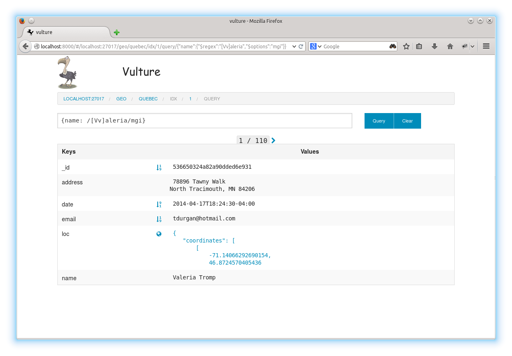

# Vulture 

An advanced [MongoDB](http://www.mongodb.org/) explorer in a web interface.  the
project is inspired by [mongs](http://whit537.org/mongs/) but has the additional goal
of new features.

*   Support for [GeoJson](http://geojson.org/) indexes.
*   Support for GridFS

### screenshots

